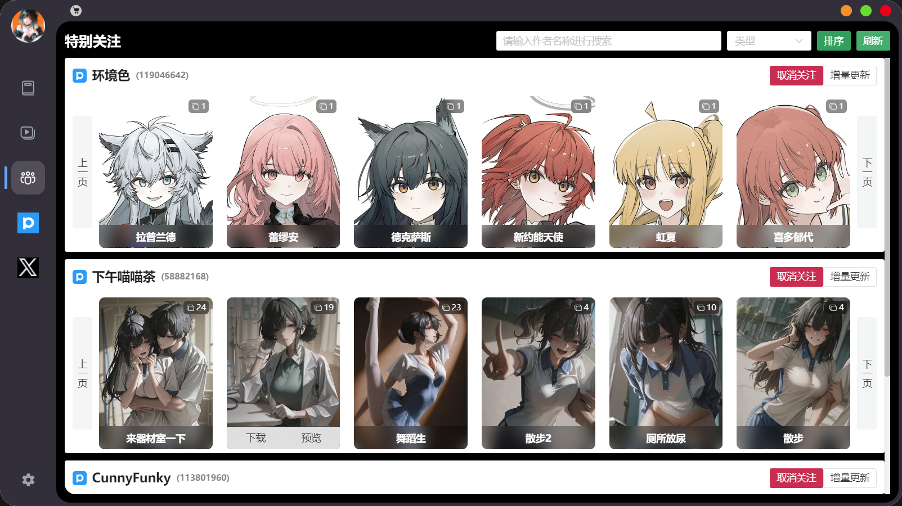

# Comic Reader

本地漫画/视频阅读与第三方网站预览下载工具。基于 Electron + Vue3 + Vite，支持图片/PDF/EPUB 漫画阅读，视频资源浏览与播放（含书签收藏、DLNA 投屏），以及 Twitter/Pixiv/精选站点的 WebView 预览与下载抓取。

- 跨平台：Windows / macOS / Linux
- 一体化体验：本地内容管理 + 在线预览与下载
- 性能优化：虚拟列表、Keep-Alive 缓存，流畅浏览大量资源

## 功能特性

- 漫画阅读

  - 资源浏览器：本地文件夹扫描、收藏夹、右键打开本地文件
    
  - 图片阅读器：翻页、缩放、键鼠操作、自动播放
    
  - 支持图片格式
    - jpg/jpeg/png/webp
    - PDF
    - EPUB

- 视频模块

  - 资源浏览：指定资源路径下的树/文件列表与收藏
  - 播放器：原生 video 播放（本地文件），进度管理
  - 书签功能：时间点收藏、增删改查
    
  - DLNA 投屏：局域网设备发现与投屏
    

- 第三方网站浏览与下载

  **注意：内置代理地址固定为127.0.0.1:7890**

  

  - JM
    - WebView 浏览
    - 章节选择下载、自动解压
  - Pixiv
    - WebView 浏览
    - 用户全部作品一键下载
    - 插画下载
    - 漫画集下载
    - 动图下载
  - Twitter
    - WebView 浏览
    - 用户媒体库一键下载
    - 视频下载

- 特别关注
  - 关注用户：支持关注上述三个网站的用户
    - Pixiv：进入用户页，点击收藏按钮
      
    - JM：进入搜索页，点击收藏按钮
      
    - Twitter：进入用户页，点击收藏按钮
      
  - 列表展示：查看最新作品和本地下载情况
    
  - 预览： 查看作品详情
    

## 快速开始

前置条件

- Node.js 18+
- npm 或 yarn
- Python

安装与启动

- 安装依赖
  - `npm install`
- 开发调试
  - `npm run dev`
- 预览（打包后预览）
  - `npm run start`
- 类型检查
  - `npm run typecheck`
- 代码格式化
  - `npm run format`

打包构建

- 通用构建
  - `npm run build`
- 针对平台的构建产物
  - Windows: `npm run build:win`
  - macOS: `npm run build:mac`
  - Linux: `npm run build:linux`

提示

- 开发模式打开 DevTools：`Ctrl/Cmd + Alt + Shift + L`
- 渲染进程 URL 由 `electron-vite` 管理，开发环境自动加载

## 技术栈

- 主进程：Electron、electron-updater、electron-log
- 预加载：@electron-toolkit/preload（contextBridge 安全暴露 API）
- 渲染层：Vue 3、Vite、Pinia、Vue Router、Naive UI、Tailwind CSS
- 阅读器：epubjs、vue-pdf-embed
- 数据与存储：sqlite/sqlite3
- 其他：lodash、dlnacasts、mime-types

## 许可证

本项目基于 MIT License 开源（见 `LICENSE`）。
