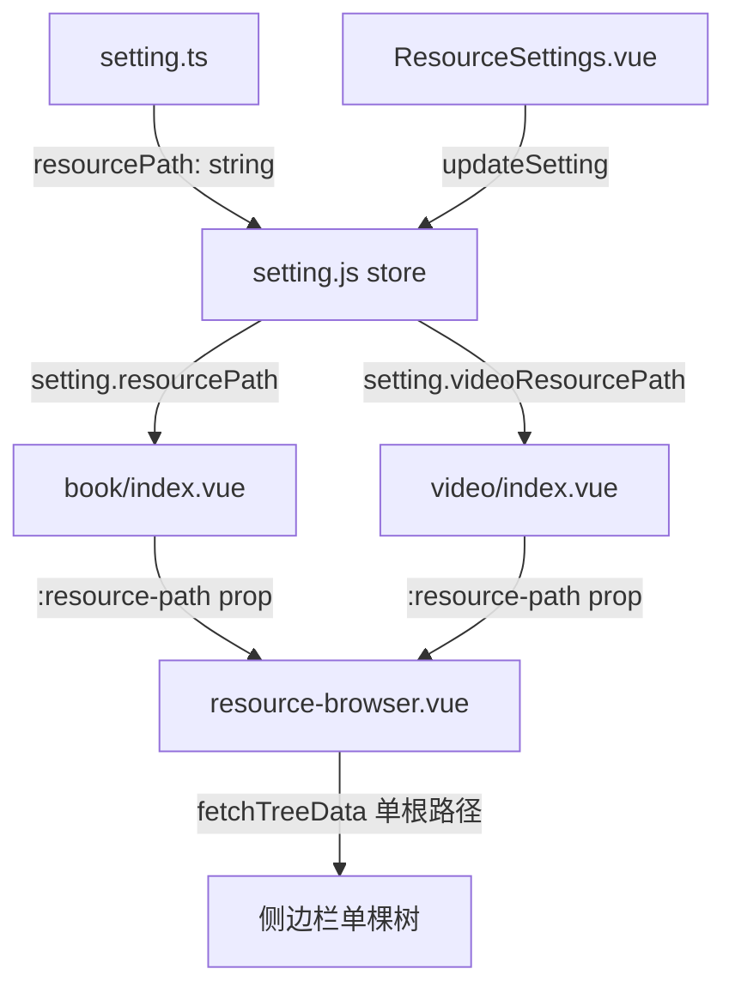
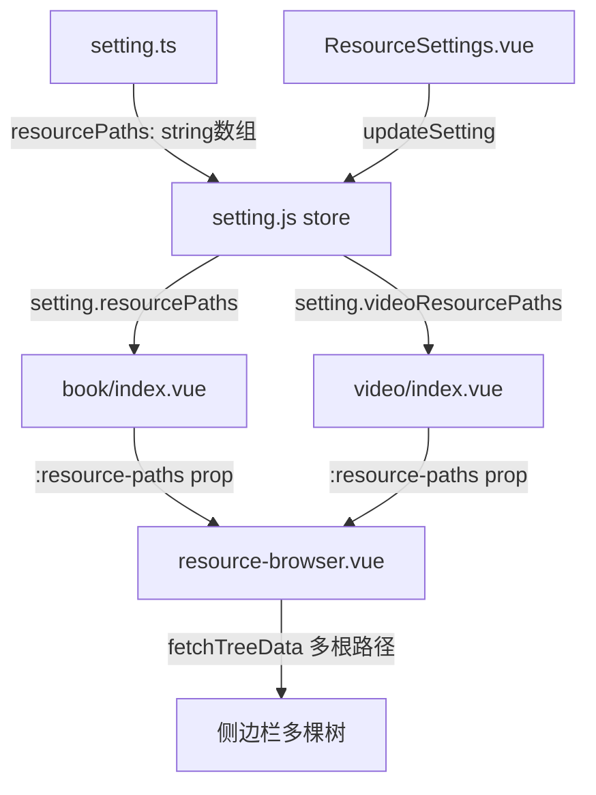
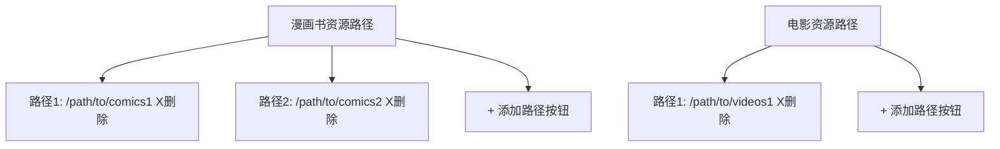
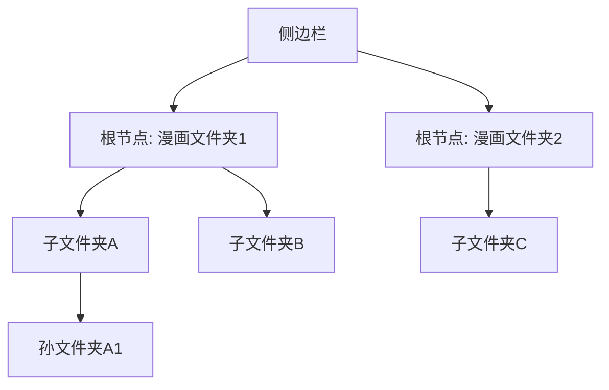

# 多资源路径功能设计方案

## 需求概述

在设置页面支持为漫画书和视频各自配置**多个**资源路径，在资源浏览器侧边栏中以**独立根节点**的形式同时显示所有路径的目录树，并增加子文件夹的缩进层级显示效果。

## 当前架构



## 目标架构



## 详细变更方案

### 1. 数据模型变更

#### `src/typings/setting.ts`

```typescript
// 旧
resourcePath: string
videoResourcePath: string

// 新 - 添加数组字段，保留旧字段用于迁移
resourcePaths: string[]       // 新：多个漫画书资源路径
videoResourcePaths: string[]  // 新：多个视频资源路径
resourcePath?: string         // 旧：向后兼容，迁移后可移除
videoResourcePath?: string    // 旧：向后兼容，迁移后可移除
```

#### `src/renderer/src/plugins/store/setting.js`

- 默认值改为空数组：`resourcePaths: []`, `videoResourcePaths: []`
- 在 `updateSetting` 方法中添加迁移逻辑：
  - 如果 `resourcePaths` 为空/undefined 但 `resourcePath` 有值 → `resourcePaths = [resourcePath]`
  - 如果 `videoResourcePaths` 为空/undefined 但 `videoResourcePath` 有值 → `videoResourcePaths = [videoResourcePath]`

### 2. ResourceSettings.vue 变更

将每个路径类型从单一输入框改为**动态列表**：



**UI 组件结构：**

- 使用 `v-for` 遍历路径数组渲染列表
- 每个路径项包含：只读输入框 + 选择文件夹按钮 + 删除按钮
- 底部添加"添加路径"按钮
- 至少保留一个路径时不可删除（或允许全部删除显示空状态）

### 3. resource-browser.vue 变更

#### Props 变更

```typescript
// 旧
interface ResourceBrowserProps {
  resourcePath: string | null
  // ...
}

// 新
interface ResourceBrowserProps {
  resourcePaths: string[] // 替换为路径数组
  // ...
}
```

#### 侧边栏多根节点树结构



**实现方式：**

- `fetchTreeData` 改为遍历 `resourcePaths` 数组
- 为每个路径创建一个顶层树节点，节点名称取路径最后一段目录名
- 所有根节点合并到 `tree.data` 数组中
- `default-expanded-keys` 设置为所有根路径
- 选中某个根节点下的子文件夹时，加载该路径的内容到网格区域

#### 样式增强 - 缩进显示

- 根节点使用**粗体**样式，带文件夹图标
- 根节点之间添加分隔线或间距
- 子节点使用标准缩进（n-tree 自带缩进，可增加 indent 属性）

### 4. book/index.vue 变更

```typescript
// 旧
const resourcePath = computed(() => settingStore.setting.resourcePath)

// 新
const resourcePaths = computed(() => settingStore.setting.resourcePaths)
```

模板中：

```html
<!-- 旧 -->
<resource-browser :resource-path="resourcePath" ... />

<!-- 新 -->
<resource-browser :resource-paths="resourcePaths" ... />
```

### 5. video/index.vue 变更

同 book/index.vue，将 `videoResourcePath` 改为 `videoResourcePaths`。

### 6. 向后兼容迁移

在 `setting.js` 的 `updateSetting` 方法中：

```javascript
// 迁移旧的单一路径到新的数组格式
if (settingData.resourcePaths === undefined) {
  settingData.resourcePaths = settingData.resourcePath ? [settingData.resourcePath] : []
}
if (settingData.videoResourcePaths === undefined) {
  settingData.videoResourcePaths = settingData.videoResourcePath
    ? [settingData.videoResourcePath]
    : []
}
```

## 文件变更清单

| 文件                                                       | 变更类型 | 说明                                                  |
| ---------------------------------------------------------- | -------- | ----------------------------------------------------- |
| `src/typings/setting.ts`                                   | 修改     | 添加 `resourcePaths` 和 `videoResourcePaths` 数组字段 |
| `src/renderer/src/plugins/store/setting.js`                | 修改     | 更新默认值，添加迁移逻辑                              |
| `src/renderer/src/views/setting/tabs/ResourceSettings.vue` | 重写     | 动态路径列表，支持增删                                |
| `src/renderer/src/components/resource-browser.vue`         | 修改     | 接收路径数组，多根节点树，缩进样式                    |
| `src/renderer/src/views/book/index.vue`                    | 修改     | 传递路径数组                                          |
| `src/renderer/src/views/video/index.vue`                   | 修改     | 传递路径数组                                          |

## 侧边栏 UI 样式详细设计

### 当前侧边栏结构（单根节点）

```
┌──────────────────────┐
│ 📁 资源目录           │  ← 单一根节点，名称固定为"资源目录"
│   ├─ 📁 漫画A         │
│   │   ├─ 📁 第1话     │
│   │   └─ 📁 第2话     │
│   ├─ 📁 漫画B         │
│   └─ 📁 漫画C         │
└──────────────────────┘
```

### 目标侧边栏结构（多根节点 + 缩进）

```
┌──────────────────────┐
│ 📂 D:\Comics          │  ← 根节点1：路径最后一段目录名，粗体
│   ├─ 📁 漫画A         │  ← 一级子节点：标准缩进
│   │   ├─ 📁 第1话     │  ← 二级子节点：更深缩进
│   │   └─ 📁 第2话     │
│   ├─ 📁 漫画B         │
│   └─ 📁 漫画C         │
│ ───────────────────── │  ← 根节点之间的分隔线
│ 📂 E:\Manga           │  ← 根节点2：另一个资源路径
│   ├─ 📁 系列1         │
│   │   └─ 📁 卷1       │
│   └─ 📁 系列2         │
│ ───────────────────── │  ← 根节点之间的分隔线
│ 📂 F:\Downloads       │  ← 根节点3
│   ├─ 📁 新漫画A       │
│   └─ 📁 新漫画B       │
└──────────────────────┘
```

### 具体样式规格

#### 根节点样式

- **字体**：13px，font-weight: 600（半粗体）
- **颜色**：#1f2937（深灰色）
- **背景**：#f3f4f6（浅灰背景），hover 时变为 #e5e7eb
- **图标**：📂 Folder24Regular 图标，颜色 #6b7280
- **内边距**：padding: 8px 12px
- **圆角**：border-radius: 6px
- **选中状态**：background: #eff6ff, border-left: 3px solid #3b82f6
- **分隔线**：根节点之间添加 `border-bottom: 1px solid #e5e7eb`，最后一个根节点无分隔线

#### 一级子节点样式（相比根节点缩进 20px）

- **字体**：13px，font-weight: 400（常规）
- **颜色**：#374151
- **图标**：📁 Folder24Regular，颜色 #9ca3af
- **缩进**：padding-left: 20px（相对于根节点）

#### 二级及更深层子节点

- 每层额外缩进 16px（n-tree 的默认缩进行为）
- 字体和颜色与一级子节点相同

#### renderTreeNode 渲染函数变更

```typescript
// 新的渲染函数逻辑
const renderTreeNode = ({ option }: { option: any }) => {
  const isRoot = option.isRoot // 新增标记字段

  return h(
    'div',
    {
      class: {
        'tree-node-content': true,
        'root-node': isRoot
      }
    },
    [
      // 根节点使用不同的文件夹图标
      isRoot ? h(NIcon, { component: Folder24Regular, size: 18, class: 'root-folder-icon' }) : null,
      // 收藏标记
      option.isBookmarked
        ? h(NIcon, { component: BookmarkIcon, class: 'bookmark-icon', size: 16 })
        : null,
      h('span', { class: 'tree-node-label' }, option.name)
    ]
  )
}
```

#### CSS 样式新增

```scss
/* 根节点样式 */
.root-node {
  font-weight: 600;
  font-size: 13px;
  color: #1f2937;
  padding: 4px 0;

  .root-folder-icon {
    color: #6b7280;
    margin-right: 4px;
  }
}

/* 根节点分隔线 - 通过 renderTreeNode 在根节点后添加分隔线 */
.root-node-divider {
  border-bottom: 1px solid #e5e7eb;
  margin: 4px 0;
}

/* 增强 n-tree 的缩进 */
.folder-tree {
  .n-tree-node-content {
    padding-left: 4px;
  }

  // 根节点下的第一层子节点增加额外缩进
  .n-tree-node--root > .n-tree-node-content {
    .tree-node-content {
      font-weight: 600;
    }
  }
}
```

### fetchTreeData 逻辑变更

```typescript
// 旧逻辑：单根节点
tree.data = [{ name: '资源目录', fullPath: props.resourcePath, children: treeData }]

// 新逻辑：多根节点
const fetchTreeData = async () => {
  if (!props.resourcePaths?.length) return

  const rootNodes = []
  for (const path of props.resourcePaths) {
    const pathName = path.split(/[/\\]/).filter(Boolean).pop() || path
    const treeData = await props.provideTree(path)

    // 检查收藏状态
    for (const node of treeData) {
      try {
        node.isBookmarked = await window.tag.isFolderTagged(node.fullPath, props.namespace)
      } catch {
        node.isBookmarked = false
      }
    }

    rootNodes.push({
      name: pathName,
      fullPath: path,
      isRoot: true, // 标记为根节点
      children: treeData
    })
  }

  tree.data = rootNodes
}
```

### default-expanded-keys 变更

```typescript
// 旧：展开单个根路径
:default-expanded-keys="[props.resourcePath]"

// 新：展开所有根路径
:default-expanded-keys="props.resourcePaths"
```

## ResourceSettings.vue UI 设计

### 设置页面布局

```
┌──────────────────────────────────────────────┐
│ 漫画书资源路径                                 │
│ ┌────────────────────────────┐ ┌───┐ ┌───┐  │
│ │ D:\Comics                  │ │选择│ │ ✕ │  │
│ └────────────────────────────┘ └───┘ └───┘  │
│ ┌────────────────────────────┐ ┌───┐ ┌───┐  │
│ │ E:\Manga                   │ │选择│ │ ✕ │  │
│ └────────────────────────────┘ └───┘ └───┘  │
│ ┌──────────────────────────────────────────┐ │
│ │        + 添加资源路径                      │ │
│ └──────────────────────────────────────────┘ │
│                                              │
│ 电影资源路径                                   │
│ ┌────────────────────────────┐ ┌───┐ ┌───┐  │
│ │ D:\Videos                  │ │选择│ │ ✕ │  │
│ └────────────────────────────┘ └───┘ └───┘  │
│ ┌──────────────────────────────────────────┐ │
│ │        + 添加资源路径                      │ │
│ └──────────────────────────────────────────┘ │
└──────────────────────────────────────────────┘
```

### 组件结构

```vue
<n-form-item label="漫画书资源路径">
  <div class="path-list">
    <div v-for="(path, index) in modelValue.resourcePaths" :key="index" class="path-item">
      <n-input :value="path" readonly placeholder="请选择资源文件夹路径" />
      <n-button @click="selectResourcePath('resourcePaths', index)">选择文件夹</n-button>
      <n-button quaternary type="error" @click="removePath('resourcePaths', index)">
        <template #icon><n-icon :component="CloseSharp" /></template>
      </n-button>
    </div>
    <n-button dashed block @click="addPath('resourcePaths')">+ 添加资源路径</n-button>
  </div>
</n-form-item>
```

## 风险与注意事项

1. **数据迁移**：确保旧用户升级后自动迁移，不丢失已配置的路径
2. **空状态处理**：当路径数组为空时，显示"请先在设置中配置资源路径"的提示
3. **性能**：多个根路径同时加载树数据时，考虑并发控制和懒加载
4. **路径验证**：添加路径时检查路径是否有效、是否重复
