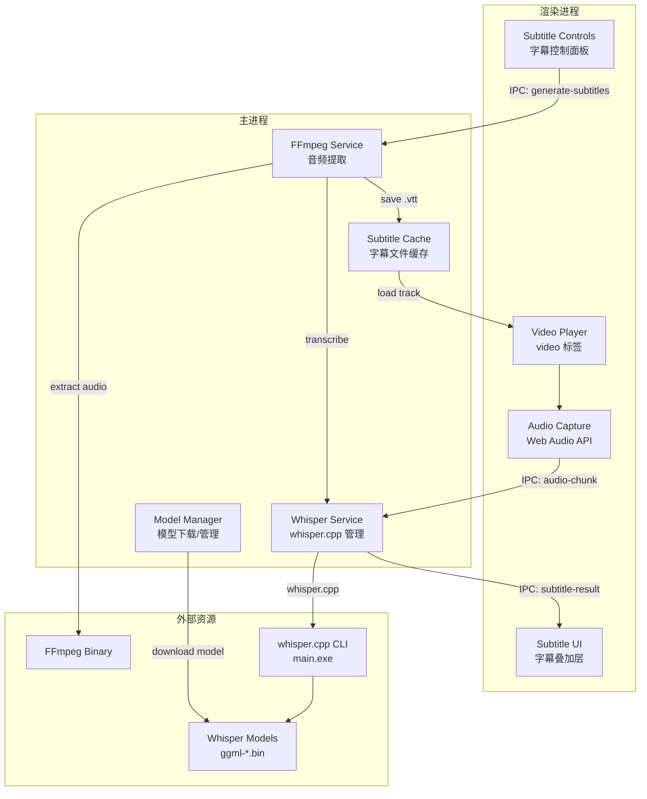
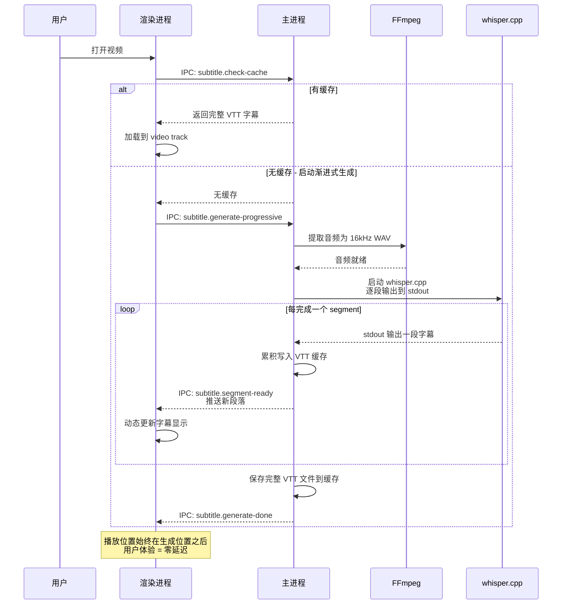
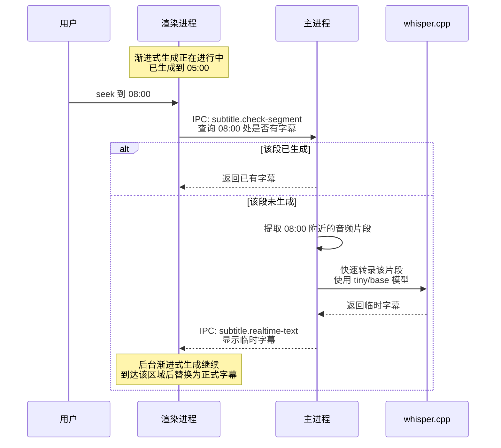
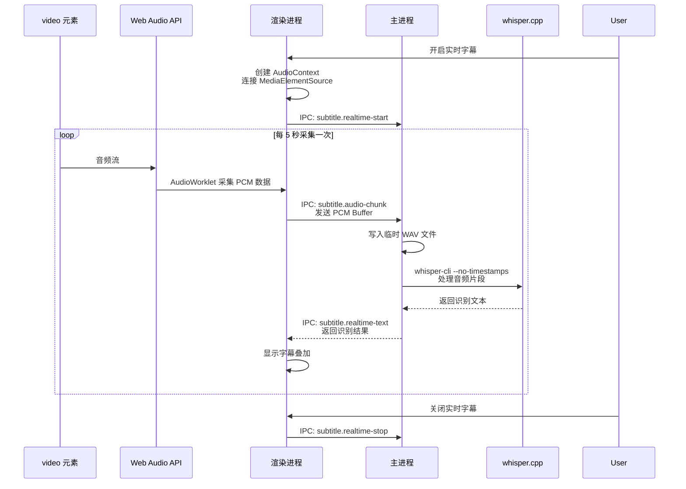

# 视频实时字幕实现方案

## 需求概述

在 comic-reader 的视频播放器中集成 Whisper 语音识别，实现：

1. **预生成字幕**：打开视频时后台生成 SRT/VTT 字幕文件并缓存
2. **实时流式识别**：视频播放过程中实时识别语音并显示字幕
3. **主要语言**：日语（兼顾中文、英文）
4. **硬件**：目标用户有 GPU（CUDA）

---

## 技术选型

### 核心引擎：whisper.cpp CLI

**为什么选 whisper.cpp 而不是其他方案？**

| 方案                      | 优点                                                                | 缺点                                  |
| ------------------------- | ------------------------------------------------------------------- | ------------------------------------- |
| **whisper.cpp CLI** ✅    | 最快推理速度、GPU 支持好、无需 native 编译、通过 child_process 调用 | 需要捆绑外部二进制                    |
| whisper-node              | API 简单                                                            | 需 native 编译，项目 npmRebuild:false |
| @huggingface/transformers | 纯 JS、无外部依赖                                                   | 推理速度较慢、ONNX GPU 支持有限       |
| Python Whisper            | 功能完整                                                            | 需 Python 环境、体积大                |

**选择理由：**

- 项目已有 `child_process.spawn` 使用经验（7zip 调用）
- 项目 `npmRebuild: false`，避免 native 模块问题
- whisper.cpp 的 CUDA 加速性能最优，适合实时场景
- CLI 模式与项目 `extraResources` 打包方式完美契合

### 音频提取：FFmpeg

- 使用 `ffmpeg-static` npm 包提供预编译的 FFmpeg 二进制
- 或直接捆绑 FFmpeg 二进制到 `extraResources`

### 模型选择

| 模型      | 大小   | 日语效果 | 实时性   | 推荐场景     |
| --------- | ------ | -------- | -------- | ------------ |
| tiny      | ~75MB  | 较差     | 最快     | 测试用       |
| base      | ~142MB | 一般     | 快       | 低配机器     |
| **small** | ~466MB | **良好** | **较快** | **推荐默认** |
| medium    | ~1.5GB | 优秀     | 较慢     | 高精度需求   |
| large     | ~2.9GB | 最佳     | 慢       | 离线预生成   |

**推荐策略：** 默认使用 `small` 模型，用户可在设置中切换

---

## 系统架构



---

## 数据流设计

### 流程1：渐进式预生成（核心方案，零延迟）

whisper.cpp 处理速度远快于实时播放（GPU 下 10x-50x），因此播放位置始终落后于生成位置，实现零延迟体验。



### 流程2：Seek 到未生成区域的降级处理

当用户 seek 到尚未生成的区域时，临时使用快速模型进行实时识别。



### 流程3：纯实时模式（备选，用于直播等场景）

仅在无法预生成时使用，存在 4-8 秒延迟。



---

## 文件结构规划

```
src/
├── main/
│   ├── services/                    # 新增：主进程服务层
│   │   ├── whisper-service.ts       # Whisper.cpp 管理服务
│   │   ├── ffmpeg-service.ts        # FFmpeg 音频提取服务
│   │   └── model-manager.ts         # 模型下载与管理
│   └── index.ts                     # 修改：注册字幕相关 IPC
├── preload/
│   ├── plugins/
│   │   └── subtitle.ts              # 新增：字幕 IPC 桥接
│   ├── index.ts                     # 修改：注册 subtitle 插件
│   └── index.d.ts                   # 修改：添加 subtitle 类型声明
├── renderer/
│   └── src/
│       ├── views/reader/type/video/
│       │   ├── index.vue            # 修改：集成字幕功能
│       │   ├── subtitle-overlay.vue # 新增：字幕叠加显示组件
│       │   └── subtitle-controls.vue# 新增：字幕控制面板
│       └── views/setting/tabs/
│           └── SubtitleSettings.vue # 新增：字幕设置页
└── typings/
    └── subtitle.ts                  # 新增：字幕相关类型定义

resources/
├── whisper/                         # 新增：whisper.cpp 资源
│   └── main.exe                     # whisper.cpp CLI 二进制
└── ffmpeg/                          # 新增：FFmpeg 资源
    └── ffmpeg.exe                   # FFmpeg 二进制
```

---

## 详细实现步骤

### 第一阶段：基础设施

#### 1. 捆绑 whisper.cpp 和 FFmpeg 二进制

- 下载预编译的 `whisper.cpp` CLI（`main.exe`）到 `resources/whisper/`
- 下载 `FFmpeg` 静态二进制到 `resources/ffmpeg/`
- 更新 `electron-builder.yml` 的 `extraResources` 配置
- 在主进程中创建获取二进制路径的工具函数

#### 2. 模型管理器（`model-manager.ts`）

- 检测模型是否已下载（存储在 `app.getPath('userData')/whisper-models/`）
- 提供模型下载功能（从 HuggingFace 下载 ggml 模型）
- 支持模型切换（tiny/base/small/medium/large）
- 下载进度通知（通过 IPC 发送到渲染进程）

#### 3. FFmpeg 服务（`ffmpeg-service.ts`）

- 从视频中提取音频为 16kHz 单声道 WAV 格式
- 支持提取指定时间段音频（用于实时模式）
- 处理各种视频格式（mp4, avi, mkv, mov 等）

### 第二阶段：预生成字幕

#### 4. Whisper 服务（`whisper-service.ts`）

- 封装 whisper.cpp CLI 调用
- 支持全量转录（输出 SRT/VTT 格式）
- 支持片段转录（用于实时模式）
- 管理子进程生命周期
- GPU 检测与配置（`--use-gpu` 参数）

#### 5. 字幕缓存系统

- 以视频文件路径 + 文件大小 + 修改时间生成缓存 key
- 缓存目录：`app.getPath('userData')/subtitle-cache/`
- 缓存格式：WebVTT（`.vtt`）
- 缓存元数据存储在 SQLite 或 JSON 文件中

#### 6. IPC 接口层

- `subtitle:check-cache` - 检查字幕缓存
- `subtitle:generate` - 触发字幕生成
- `subtitle:generate-progress` - 生成进度通知
- `subtitle:get-languages` - 获取支持的语言列表

### 第三阶段：实时流式识别

#### 7. 音频采集（渲染进程）

- 使用 Web Audio API 创建 `AudioContext`
- 从 `<video>` 元素创建 `MediaElementAudioSourceNode`
- 使用 `AudioWorkletNode` 采集 16kHz PCM 数据
- 每 5 秒收集一个音频片段（带 1 秒重叠以避免截断）
- 通过 IPC 将 PCM Buffer 发送到主进程

#### 8. 实时转录管道

- 主进程接收音频 chunk
- 写入临时 WAV 文件
- 调用 whisper.cpp 进行转录
- 将结果通过 IPC 返回渲染进程
- 管理并发和队列（避免多个 whisper 实例同时运行）

#### 9. 字幕叠加显示（`subtitle-overlay.vue`）

- 半透明背景的字幕文本
- 支持字体大小调节
- 支持位置调节（底部/顶部）
- 平滑的文本切换动画
- 与预生成字幕共存显示

### 第四阶段：UI 和设置

#### 10. 字幕控制面板（`subtitle-controls.vue`）

- 开启/关闭字幕按钮
- 预生成 vs 实时模式切换
- 语言选择（日语/中文/英文/自动检测）
- 字幕样式设置（字体大小、位置、透明度）

#### 11. 设置页面（`SubtitleSettings.vue`）

- Whisper 模型选择和下载管理
- GPU 加速开关
- 默认语言设置
- 字幕样式自定义
- 缓存管理（查看/清除缓存）

### 第五阶段：集成和优化

#### 12. 视频播放器集成

- 修改 `video/index.vue` 集成字幕组件
- 在视频控制栏中添加字幕按钮
- 处理视频切换时的字幕状态管理
- 处理 seek 操作时的字幕同步

#### 13. 性能优化

- whisper.cpp 实例复用（避免反复启动进程）
- 音频 chunk 处理队列优化
- GPU 内存管理
- 大文件分段处理

---

## IPC 接口设计

```typescript
// subtitle.ts - Preload 插件接口
interface SubtitleAPI {
  // 检查字幕缓存
  checkCache(videoPath: string): Promise<{ cached: boolean; subtitlePath?: string }>

  // 生成字幕（预生成模式）
  generate(videoPath: string, options?: GenerateOptions): Promise<string>

  // 取消生成
  cancelGenerate(): Promise<void>

  // 实时模式 - 开始
  startRealtime(options?: RealtimeOptions): Promise<void>

  // 实时模式 - 发送音频数据
  sendAudioChunk(pcmData: ArrayBuffer): Promise<void>

  // 实时模式 - 停止
  stopRealtime(): Promise<void>

  // 模型管理
  getModels(): Promise<ModelInfo[]>
  downloadModel(modelName: string): Promise<void>
  deleteModel(modelName: string): Promise<void>

  // 设置
  getSettings(): Promise<SubtitleSettings>
  updateSettings(settings: Partial<SubtitleSettings>): Promise<void>

  // 事件监听
  onGenerateProgress(callback: (progress: number) => void): () => void
  onRealtimeText(callback: (text: string, isFinal: boolean) => void): () => void
  onDownloadProgress(callback: (progress: number) => void): () => void
}

interface GenerateOptions {
  language?: string // 'ja' | 'zh' | 'en' | 'auto'
  model?: string // 'tiny' | 'base' | 'small' | 'medium' | 'large'
  force?: boolean // 强制重新生成
}

interface RealtimeOptions {
  language?: string
  model?: string
  chunkDuration?: number // 秒，默认 5
}

interface ModelInfo {
  name: string
  size: string
  downloaded: boolean
  path?: string
}

interface SubtitleSettings {
  defaultLanguage: string
  defaultModel: string
  useGpu: boolean
  fontSize: number
  subtitlePosition: 'top' | 'bottom'
  opacity: number
  autoGenerate: boolean // 打开视频时自动生成
}
```

---

## 关键技术细节

### whisper.cpp 调用方式

```bash
# 预生成模式 - 输出 SRT
main.exe -m models/ggml-small.bin -f audio.wav -l ja --output-srt

# 实时模式 - 片段识别
main.exe -m models/ggml-small.bin -f chunk.wav -l ja --no-timestamps

# GPU 加速
main.exe -m models/ggml-small.bin -f audio.wav -l ja --use-gpu
```

### FFmpeg 音频提取

```bash
# 提取完整音频为 16kHz 单声道 WAV
ffmpeg.exe -i video.mp4 -ar 16000 -ac 1 -c:a pcm_s16le output.wav

# 提取指定时间段音频
ffmpeg.exe -i video.mp4 -ss 00:01:30 -t 5 -ar 16000 -ac 1 -c:a pcm_s16le chunk.wav
```

### Web Audio API 音频采集

```typescript
// 渲染进程中的音频采集
const audioContext = new AudioContext({ sampleRate: 16000 })
const source = audioContext.createMediaElementSource(videoElement)
const processor = audioContext.createScriptProcessor(4096, 1, 1)

source.connect(processor)
processor.connect(audioContext.destination)

processor.onaudioprocess = (e) => {
  const pcmData = e.inputBuffer.getChannelData(0)
  // 收集 PCM 数据，达到 chunk 大小后发送到主进程
}
```

---

## 打包配置更新

```yaml
# electron-builder.yml 新增
extraResources:
  - from: python_scripts
    to: python_scripts
    filter: ['**/*']
  - from: resources/whisper
    to: whisper
    filter: ['**/*']
  - from: resources/ffmpeg
    to: ffmpeg
    filter: ['**/*']
```

---

## 风险和注意事项

1. **模型体积**：small 模型约 466MB，不应打包进安装包，应首次使用时下载
2. **GPU 兼容性**：需要检测 CUDA 是否可用，降级到 CPU 模式
3. **内存占用**：whisper.cpp 运行时可能占用 1-2GB 内存，需注意资源管理
4. **实时延迟**：预计 4-8 秒延迟（取决于 chunk 大小和 GPU 性能）
5. **音频格式兼容**：需要确保 FFmpeg 能处理所有支持的视频格式
6. **跨平台**：当前方案以 Windows 为主，Mac/Linux 需要不同的二进制文件
