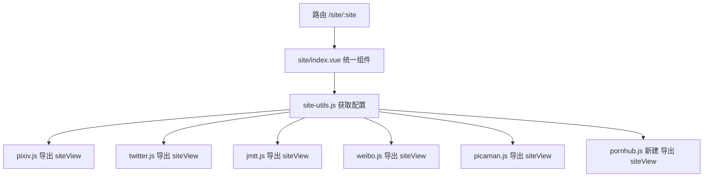

# Site View 统一重构计划

## 背景

当前 `src/renderer/src/views/site/` 目录下有 6 个独立的 Vue 文件（jmtt、pixiv、twitter、weibo、pornhub、picaman），模板和样式完全相同，核心逻辑结构高度相似。重构目标是将它们合并为一个统一的 `index.vue`，差异逻辑通过各自的 util 文件提供。

## 设计思路

每个站点的 util 文件（`special-attention/pixiv.js` 等）新增一个 `siteView` 导出对象，包含该站点在 webview 视图中的差异化配置。`site-utils.js` 汇总这些配置，统一的 `index.vue` 从 `site-utils.js` 读取。



## 文件结构变更

```
src/renderer/src/views/
├── site/
│   ├── index.vue                    # 新建：统一的 SiteView 组件
│   ├── utils.js                     # 保持不变
│   ├── jmtt.vue                     # 删除
│   ├── pixiv.vue                    # 删除
│   ├── twitter.vue                  # 删除
│   ├── weibo.vue                    # 删除
│   ├── pornhub.vue                  # 删除
│   └── picaman.vue                  # 删除
├── special-attention/
│   ├── site-utils.js                # 扩展：引用各 util 的 siteView 配置
│   ├── jmtt.js                      # 扩展：新增 siteView 导出
│   ├── pixiv.js                     # 扩展：新增 siteView 导出
│   ├── twitter.js                   # 扩展：新增 siteView 导出
│   ├── weibo.js                     # 扩展：新增 siteView 导出
│   ├── picaman.js                   # 扩展：新增 siteView 导出
│   └── pornhub.js                   # 新建：pornhub 站点 util + siteView
```

## siteView 对象接口定义

每个 util 文件新增导出的 `siteView` 对象结构：

```typescript
interface SiteViewConfig {
  /** 站点初始 URL */
  url: string
  /**
   * 根据当前 URL 更新状态
   * @param currentUrl - webview 当前页面 URL
   * @returns 状态对象，包含是否可下载、是否可关注、以及额外数据
   */
  updateStatus: (currentUrl: string) => {
    canDownload: boolean
    canAttention: boolean
    extra?: Record<string, any>
  }
  /**
   * 执行下载
   * @param context - 上下文对象
   * @param context.extra - updateStatus 返回的额外数据
   * @param context.getCurrentUrl - 获取当前 URL 的函数
   * @param context.tip - Tip 提示工具实例
   */
  download: (context: {
    extra: Record<string, any>
    getCurrentUrl: () => string
    tip: any
  }) => Promise<void>
  /**
   * 添加特别关注（可选，不支持则为 null）
   */
  addSpecialAttention?: (context: {
    extra: Record<string, any>
    getCurrentUrl: () => string
    tip: any
  }) => Promise<void>
  /**
   * 站点特定的 onMounted 逻辑（可选）
   * @returns 清理函数（可选）
   */
  onMounted?: (webview: any) => (() => void) | void
  /**
   * 站点特定的 onUnmounted 逻辑（可选）
   */
  onUnmounted?: () => void
}
```

## 各 util 文件的 siteView 实现

### picaman.js - 新增导出

```javascript
export const siteView = {
  url: 'https://www.wnacg.com/',
  updateStatus(currentUrl) {
    const match = currentUrl.match(/photos-(?:index|slide)-aid-(\d+)/)
    if (match) {
      return { canDownload: true, canAttention: false, extra: { comicId: match[1] } }
    }
    return { canDownload: false, canAttention: false, extra: {} }
  },
  async download({ extra }) {
    if (extra.comicId) {
      await downloadArtwork(null, extra.comicId)
    }
  },
  // picaman 不支持特别关注，不导出 addSpecialAttention
}
```

### jmtt.js - 新增导出

```javascript
export const siteView = {
  url: 'https://jmcomic-zzz.one/',
  updateStatus(currentUrl) {
    const match = currentUrl.match(/\/album\/(\d+)/)
    const isBatch = currentUrl.includes('main_tag=2')
    let searchQuery = null
    if (isBatch) {
      const urlObj = new URL(currentUrl)
      searchQuery = decodeURIComponent(urlObj.searchParams.get('search_query'))
    }
    return {
      canDownload: !!(match || isBatch),
      canAttention: isBatch,
      extra: {
        comicId: match ? match[1] : null,
        downloadType: match ? 'one' : isBatch ? 'batch' : null,
        searchQuery
      }
    }
  },
  async download({ extra }) {
    if (extra.downloadType === 'one') {
      await downloadArtwork(null, extra.comicId)
    } else if (extra.downloadType === 'batch') {
      await downloadAllMedia(extra.searchQuery)
    }
  },
  async addSpecialAttention({ extra, tip }) {
    await window.specialAttention.add({
      source: 'jmtt',
      authorId: extra.searchQuery,
      authorName: extra.searchQuery
    })
    tip.success('已添加到特别关注')
  },
  onMounted(webview) {
    // 注册 IPC download:prepare 监听
    const handler = async (event, data) => { /* ... 原有逻辑 ... */ }
    window.electron.ipcRenderer.on('download:prepare', handler)
    return () => {
      window.electron.ipcRenderer.removeListener('download:prepare', handler)
    }
  }
}
```

### pixiv.js - 新增导出

```javascript
export const siteView = {
  url: 'https://www.pixiv.net/',
  updateStatus(currentUrl) {
    let downloadType = null
    let canDownload = true
    if (currentUrl.includes('artworks')) {
      downloadType = 'artwork'
    } else if (currentUrl.includes('illustrations')) {
      downloadType = 'illusts'
    } else if (currentUrl.includes('series')) {
      downloadType = 'managa'
    } else {
      canDownload = false
    }
    const canAttention = !!currentUrl && currentUrl.includes('users')
    return { canDownload, canAttention, extra: { downloadType } }
  },
  async download({ extra, tip }) {
    // 根据 downloadType 分发到 downloadArtwork/downloadIllusts/downloadManga
    // 需要辅助函数 extractFromUrl
  },
  async addSpecialAttention({ tip }) {
    // 需要辅助函数 extractFromUrl
  }
}
```

### twitter.js - 新增导出

```javascript
export const siteView = {
  url: 'https://x.com/',
  updateStatus(currentUrl) {
    const author = extractFromUrlByKey(currentUrl, 'x.com')
    let downloadType = null
    let canDownload = true
    if (currentUrl.includes('status')) {
      downloadType = 'video'
    } else if (author !== 'home') {
      downloadType = 'media'
    } else {
      canDownload = false
    }
    return { canDownload, canAttention: author !== 'home', extra: { downloadType } }
  },
  async download({ extra, tip }) { /* ... */ },
  async addSpecialAttention({ tip }) { /* ... */ }
}
```

### weibo.js - 新增导出

```javascript
export const siteView = {
  url: 'https://weibo.com/',
  updateStatus(currentUrl) { /* ... */ },
  async download({ extra, tip }) { /* ... */ },
  async addSpecialAttention({ tip }) { /* ... */ },
  onMounted(webview) {
    // 注入 JS 覆盖 window.open 和链接点击
    webview.addEventListener('dom-ready', () => {
      webview.executeJavaScript(`/* ... 原有注入代码 ... */`)
    })
  }
}
```

### pornhub.js - 新建文件

```javascript
// 需要新建 special-attention/pornhub.js
export const siteView = {
  url: 'https://cn.pornhub.com/',
  updateStatus(currentUrl) {
    const canDownload = currentUrl.includes('view_video.php') && currentUrl.includes('viewkey=')
    return { canDownload, canAttention: false, extra: {} }
  },
  async download({ tip }) { /* ... */ },
  // pornhub 不支持特别关注
}
```

## 辅助函数提取

多个站点共用 `extractFromUrl` 辅助函数，提取到 `site/utils.js` 中：

```javascript
// 添加到 site/utils.js
export function extractFromUrl(currentUrl, key) {
  try {
    const parts = currentUrl.split('/').filter(Boolean)
    const idx = parts.findIndex((p) => p === key)
    if (idx !== -1 && parts[idx + 1]) return parts[idx + 1]
    return null
  } catch {
    return null
  }
}
```

## site-utils.js 变更

在现有 `sites` 映射中引用各 util 的 `siteView`，并新增导出函数：

```javascript
// 在 sites 映射中增加 siteView 引用
import PixivUtil, { siteView as pixivSiteView } from './pixiv.js'
import TwitterUtil, { siteView as twitterSiteView } from './twitter.js'
// ... 类似处理其他站点

const sites = {
  pixiv: {
    util: PixivUtil,
    siteView: pixivSiteView,
    icon: pixivImg,
    downloadPathSetting: 'downloadPathPixiv'
  },
  // ... 其他站点同理
}

// 新增导出
function getSiteViewConfig(site) {
  return sites[site]?.siteView || null
}
```

## 统一组件 site/index.vue

```vue
<template>
  <div class="site">
    <webview ref="webviewRef" :src="url" partition="persist:thirdparty" allowpopups />
  </div>
</template>

<script setup lang="ts" name="site-view">
import { ref, computed, onMounted, onUnmounted } from 'vue'
import { useRoute } from 'vue-router'
import siteUtils from '@renderer/views/special-attention/site-utils.js'
import { Tip } from './utils'

const route = useRoute()
const siteName = computed(() => route.params.site as string)
const config = computed(() => siteUtils.getSiteViewConfig(siteName.value))

const url = ref(config.value?.url || '')
const webviewRef = ref<any>(null)
const canDownload = ref(false)
const canAttention = ref(false)
const extraState = ref<Record<string, any>>({})

function getCurrentUrl() {
  const wv = webviewRef.value
  if (!wv) return ''
  return typeof wv.getURL === 'function' ? wv.getURL() : wv.src
}

function updateCanDownload() {
  try {
    const currentUrl = getCurrentUrl()
    if (!currentUrl || !config.value?.updateStatus) return
    const result = config.value.updateStatus(currentUrl)
    canDownload.value = result.canDownload
    canAttention.value = result.canAttention
    extraState.value = result.extra || {}
  } catch {
    canDownload.value = false
    canAttention.value = false
  }
}

async function download() {
  if (!config.value?.download) return
  const tip = new Tip()
  try {
    await config.value.download({ extra: extraState.value, getCurrentUrl, tip })
  } catch (error) {
    tip.error(error)
  }
}

async function addSpecialAttention() {
  if (!config.value?.addSpecialAttention) return
  const tip = new Tip()
  try {
    await config.value.addSpecialAttention({ extra: extraState.value, getCurrentUrl, tip })
  } catch (e) {
    tip.error(e)
  }
}

let cleanupFn = null

onMounted(() => {
  const wv = webviewRef.value
  if (!wv) return
  updateCanDownload()
  wv.addEventListener('did-navigate', updateCanDownload)
  wv.addEventListener('did-navigate-in-page', updateCanDownload)
  wv.addEventListener('dom-ready', updateCanDownload)
  if (config.value?.onMounted) {
    cleanupFn = config.value.onMounted(wv) || null
  }
})

onUnmounted(() => {
  if (cleanupFn) cleanupFn()
  if (config.value?.onUnmounted) config.value.onUnmounted()
})

defineExpose({ download, canDownload, canAttention, addSpecialAttention })
</script>

<style lang="scss">
.site {
  padding: 10px;
  height: 100%;
  width: 100%;
  webview {
    width: 100%;
    height: 100%;
    background: #fff;
    border-radius: 14px;
    overflow: hidden;
  }
}
</style>
```

## 路由配置变更

```typescript
// plugins/router/modules/index.ts
// 修改前：6 个独立子路由
// 修改后：
{
  path: '/site',
  name: 'site',
  children: [
    {
      path: ':site',
      name: 'site-view',
      component: () => import('@renderer/views/site/index.vue'),
      meta: { keepAlive: true }
    }
  ]
}
```

## Layout 变更

### 1. keep-alive include

```typescript
// 修改前
<keep-alive include="book,video,reader,search,jmtt,pixiv,twitter,weibo,picaman,specialAttention">
// 修改后
<keep-alive include="book,video,reader,search,site-view,specialAttention">
```

### 2. 菜单项结构

```typescript
// 修改前
{ image: jmttImg, name: 'jmtt' }
// 修改后
{ image: jmttImg, name: 'site-view', site: 'jmtt' }
```

### 3. 菜单点击逻辑

```typescript
function handleMenuClick(index, item) {
  if (item.site) {
    router.push({ name: item.name, params: { site: item.site } })
  } else {
    router.push({ name: item.name })
  }
}
```

### 4. Active 判断

```typescript
// 需要同时匹配路由名称和 site 参数
function isMenuActive(item) {
  if (item.site) {
    return route.name === item.name && route.params.site === item.site
  }
  return route.name === item.name
}
```

## 实施步骤

1. 在 `site/utils.js` 中添加 `extractFromUrl` 辅助函数
2. 在各 util 文件中新增 `siteView` 导出（picaman.js、jmtt.js、pixiv.js、twitter.js、weibo.js）
3. 新建 `special-attention/pornhub.js`（含 siteView 导出）
4. 扩展 `site-utils.js`，引用各 siteView 并导出 `getSiteViewConfig`
5. 创建统一的 `site/index.vue` 组件
6. 更新路由配置 `plugins/router/modules/index.ts`
7. 更新 `layout/index.vue`（keep-alive、菜单项、active 判断、路由跳转）
8. 删除旧的 6 个独立站点 Vue 文件
9. 测试验证所有站点功能正常
